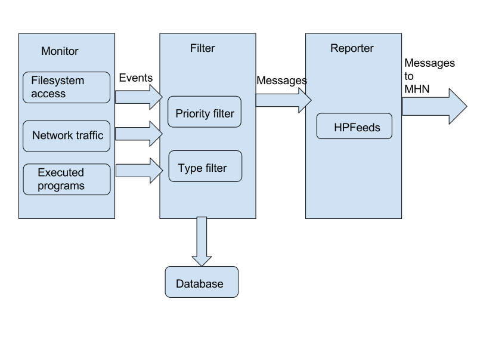

# None of Your Beeswax! [](https://travis-ci.org/iankronquist/senior-project-experiment)


## *A Next-Generation Honeypot*

There are a wide variety of open source honeypot solutions available on the
market, but most of these emulate the behavior of vulnerable software instead
of directly observing the actions of the actual vulnerable software. The flaw
in this approach is that if emulator and the original vulnerable software
differ in behavior the malware author can discover that the system is actually
a honeypot. Software inside the honeypot should be unable to observe software
outside of the honeypot. However, software outside of the honeypot can safely
peak over the walls of the container by querying the proper kernel namespaces.
In this way, malware inside the honeypot will conclude that it is running on a
bare-bones container host, but will be ignorant of the fact that its actions
are being observed.

We will focus on observing the container’s network traffic, which files change
within the container, and which programs are executed. In order to observe the
container’s network traffic we will use tcpdump on the host to log network
traffic within the container’s kernel namespace. I believe this will be
undetectable by the malware within the container. To observe files changing
within the container we will consider using tools which use the kernel’s
Inotify apis to observe changes within the container filesystem from the host.
To track whether new programs are executed we will likely observe the host's
`/proc` filesystem, but further research is needed.

Our first platform to build will be WordPress because of its widespread use and
notorious security vulnerabilities. We will build a system consisting of two
Docker containers. The first will be the Apache web server and WordPress
instance. The second will be the backing MySQL database. Apache, WordPress, and
MySQL will have configurations as close to default as possible, including using
default passwords. Of course, changing this configuration will be literally
changing the appropriate config files and rebuilding the containers.


## High Level Architecture

Before discussing technologies involved in the honeypot system, it is important
to create a high level design to describe how it will work and determine what
technologies will be needed. The system has four tasks:

1. Starting and configuring the honeypot.
2. Monitoring the honeypot for signs of infection.
3. Filtering false positives or background noise.
4. Reporting infection, malware payloads, etc. to the Modern Honeypot Network
   (MHN).

Consequently, we have divided the system into four components we term the
Configurator, Monitor, Filter, and Reporter. Messages will be passed between
these components.




## Installation
This honeypot only runs on Linux. Luckily for OS X users, there is a
Vagrantfile in the root of the repository to make starting development on OS X
easy.

### Dependencies
You will need this software installed to run the honeypot. If you are using the
Vagrantfile this software will be installed as part of provisioning.

* Docker
* Docker Compose
* tcpdump
* Golang (build)

Please make sure the docker daemon is running.

### Using Vagrant
On OS X you'll need to install VirtualBox and vagrant.

First, initialize and start the vm:
```
$ vagrant up --provision
```

Next, ssh to the vm and enter the project directory:
```
$ vagrant ssh
$ cd gopath/src/github.com/iankronquist/senior-project-experiment
```

## Building and Running
Run:
```
$ make c_fs_monitor/inotify
$ make
$ ./senior-project-experiment
```

Next visit http://localhost:8000 in your web browser and finish configuring
WordPress.

## Development Notes

Configure `ip netns`:
```
$ sudo mkdir -p /var/run/netns/
$ sudo ln -sf /proc/`docker inspect -f '{{ .State.Pid }}' seniorprojectexperiment_wordpress_1`/ns/net /var/run/netns/wordpress
```

```
$ sudo ip netns exec wordpress tcpdump > dump
```

You can find all of the files the containers use under here:
`/mnt/sda1/var/lib/docker/aufs/mnt`
I found this out from reading `docker info`
